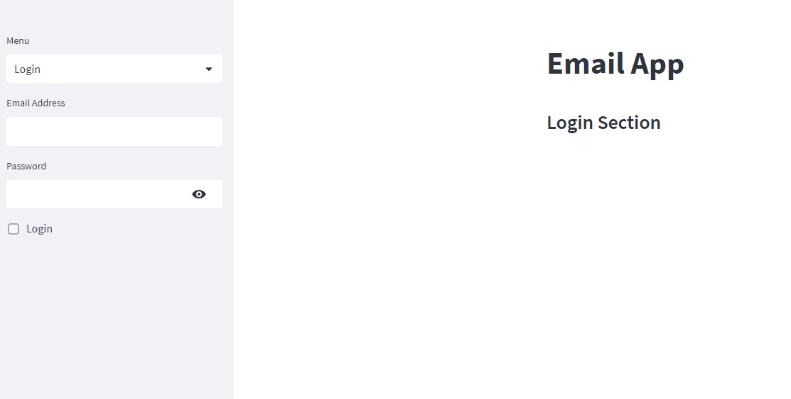

## Applink
[applink](https://email-platform.onrender.com/)
### Requirements 1

### Requirements 2

### Requirements 3

### Requirments 4

### Requirements 5


## Overview
This is an email platform where you can signup and login with your signup emailaddress. In addition, you can send message to your friend if your friend create account in this platform.

## Technical Aspect
This project is divided into three parts:

  - Build a Email platform using streamlit and the information of the accounts are stored in the sqlite database.
  - Training a deep learning model using Tensorflow and Keras for categorizing the messages into primary, social, promotion and forum.
  - Deploying the whole project into Render.

## Installation
The code is written in Python 3.7. To install the required packeges and libraries, run this command in the project directory after [cloning]() the respository:
```bash
pip install -r requirements.txt
```
## Technologies Used


[](https://www.tensorflow.org/)
[](https://keras.io/)

[](https://streamlit.io/brand)
